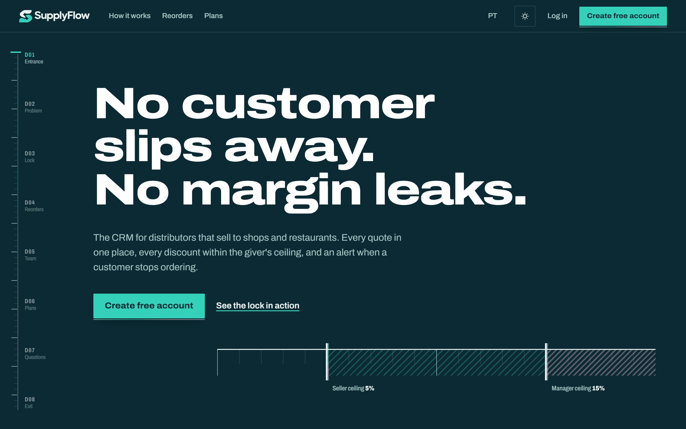
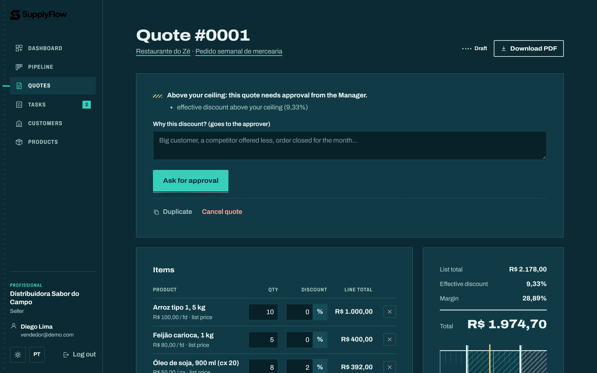
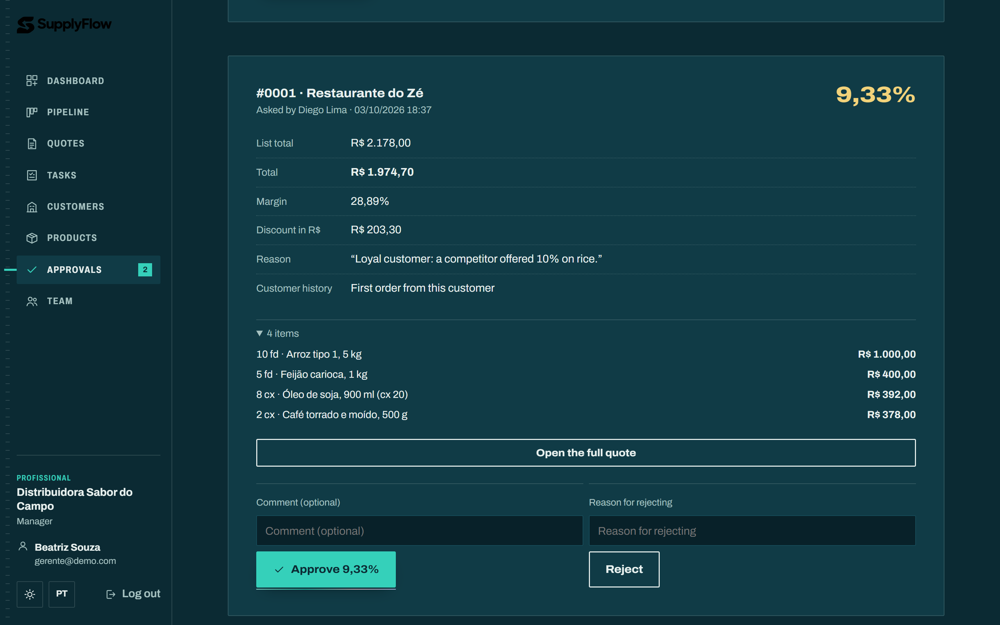
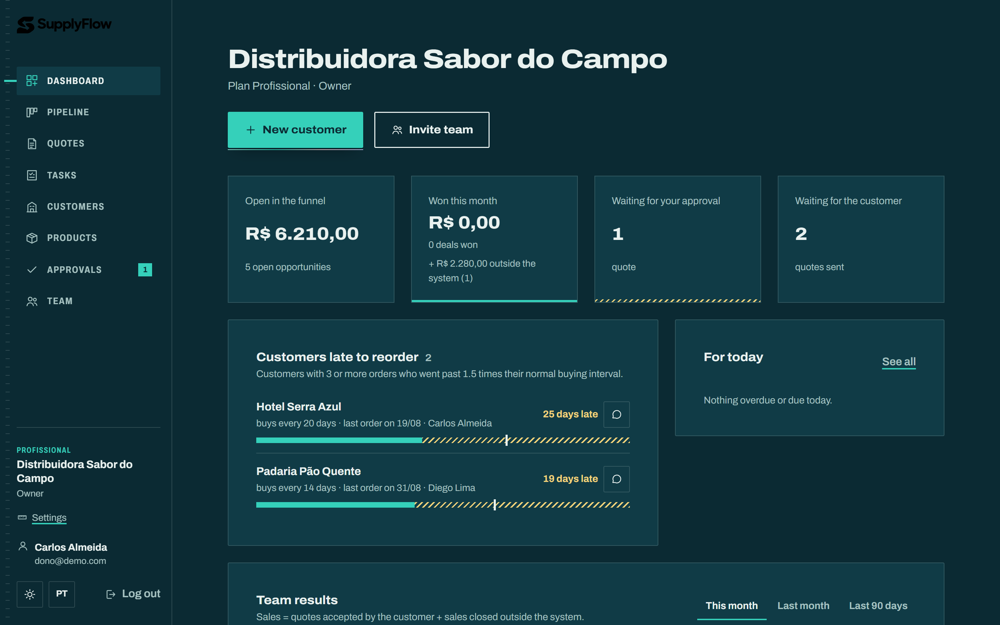
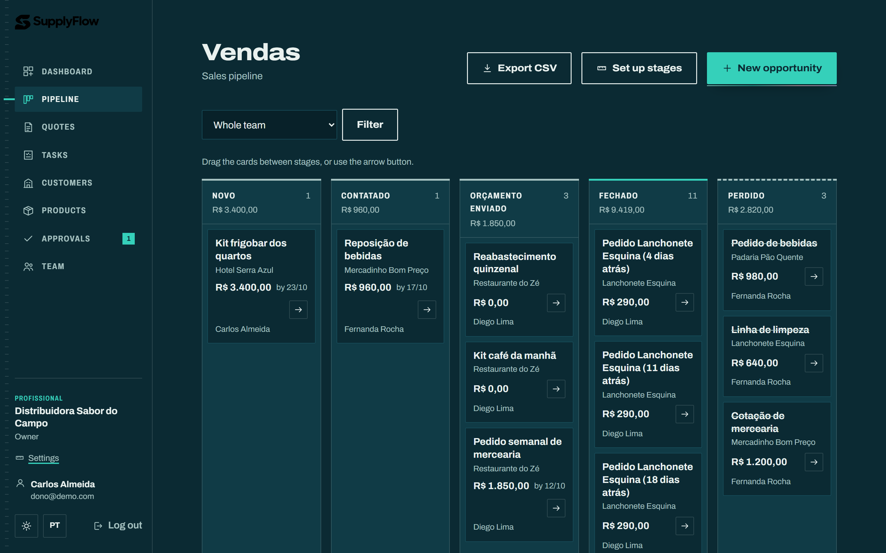
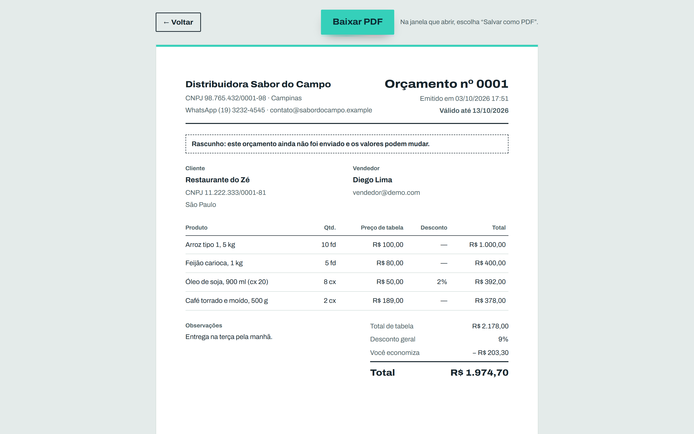
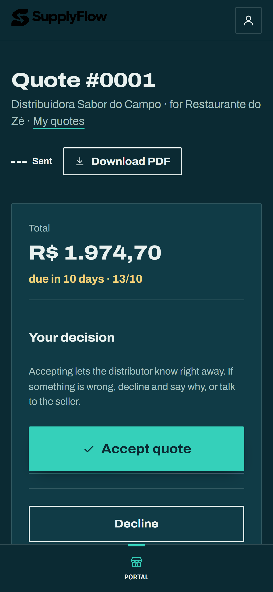

# SupplyFlow

**A CRM for food distributors where no discount goes out without the right approval.**

SupplyFlow is a multi-company web CRM for distributors that sell rice, coffee, oil and other supplies to restaurants, bakeries, markets and hotels. Every role has a discount limit: a quote above the seller's limit is blocked until a manager approves *that exact discount*. The customer then opens the quote on the phone and accepts it with one tap, and the owner follows sales, commissions and customers who stopped buying on a dashboard.

> 🎓 This was my **final project for [CS50x 2026](https://cs50.harvard.edu/x/)**, Harvard's Introduction to Computer Science.
> 🎥 **Video demo (1:51):** https://youtu.be/nsJty3MG6G8

(Leia em português: [README_PT.md](README_PT.md).)



## The problem

In Brazil, most sales between distributors and their customers happen on WhatsApp. A customer asks for a bigger discount, the seller says yes on the spot, and the owner only finds out days later, when the margin is already gone. Prices live in spreadsheets with names like `prices_v3_FINAL.xlsx`, nobody notices when a good customer quietly stops ordering, and the buyer receives quotes as loose PDFs and messages.

## How SupplyFlow solves it

| | |
|---|---|
| **Discount limits by role** | The owner sets how far each role can go (for example, sellers up to 5%, managers up to 15%). Above the limit, the quote is **blocked** and the seller asks for approval with a reason. |
| **Approval tied to a value** | The manager sees the items, margin, reason and the customer's history on one card, and approves **that exact discount**. If the seller changes the discount later, the approval drops. A minimum margin also triggers approval, even inside the limit. |
| **Buyer portal** | The customer gets their own account, opens the quote on the phone, checks every item and **accepts or declines with one tap**. Accepting marks the deal as won automatically. |
| **Owner dashboard** | Open pipeline, sales of the period, average ticket, conversion, average discount, **seller ranking with commission**, top customers, loss reasons and overdue tasks. |
| **Repurchase alerts** | A customer with 3+ orders who goes past 1.5× their usual buying interval shows up as "late to reorder", so someone calls before the customer is lost. |

## Screenshots

| Quote above the seller's limit | Manager approval |
|---|---|
|  |  |
| **Owner dashboard** | **Sales pipeline** |
|  |  |
| **Quote document (A4 / PDF)** | **Buyer portal on the phone** |
|  |  |

## Features

- **Companies and teams.** A distributor signs up, fills its company data (name, CNPJ, contact, logo) and sets the discount limits on a live ruler. The owner invites managers and sellers by link (single use, expires in 7 days). Many distributors share the same system and never see each other's data.
- **Customers, products and pipeline.** Customers and contacts with CNPJ validation and search; a product catalog with cost in R$ or %, showing the margin; a pipeline board with configurable stages, drag and drop, tasks and an append-only history (notes, calls, WhatsApp messages, stage changes).
- **Quotes.** Item and quote-wide discounts, totals recalculated on the server, numbering per distributor, a state machine (draft → waiting for approval / ready → sent → accepted, declined, expired or cancelled), an approval queue, an A4 document for the customer and a draft kept in the browser in case the connection drops.
- **Roles.** Owner, manager and seller. Sellers see only their own deals and quotes; managers and the owner see everything. The customer list is shared, so two sellers don't register the same restaurant.
- **Plans.** Four plans with quotas (users, customers, products, quotes per month), stored as data. A separate platform-operator panel changes plans without ever showing business data.
- **Also:** CSV export (protected against spreadsheet formula injection), password reset by e-mail, Portuguese and English interface, dark and light themes, terms and privacy pages.

## Tech stack

- **Back end:** Python 3, Flask (blueprints), SQLite through [CS50's SQL library](https://cs50.readthedocs.io/libraries/cs50/python/)
- **Front end:** Jinja templates, plain HTML, CSS and JavaScript (no front-end framework)
- **Tests:** Python's built-in `unittest`

## Run it locally

Requires Python 3.10+.

```bash
git clone https://github.com/paulocolugnati/supplyflow.git
cd supplyflow
python -m venv .venv
# Windows: .venv\Scripts\activate    macOS/Linux: source .venv/bin/activate
pip install -r requirements.txt
python -m flask --app app init-db   # creates project.db from schema.sql
python seed.py                      # optional: fictional demo data
python -m flask --app app run
```

Open http://127.0.0.1:5000.

**Demo accounts** (password `demo1234`, created by `seed.py`):

| E-mail | Role |
|---|---|
| `dono@demo.com` | Owner |
| `gerente@demo.com` | Manager |
| `vendedor@demo.com` | Seller |
| `comprador@demo.com` | Buyer (customer of two distributors) |
| `plataforma@demo.com` | Platform operator |

**Optional environment variables:**
- `SUPPORT_WHATSAPP`: the support number shown on the plans page.
- `MAIL_USERNAME` and `MAIL_PASSWORD`: a Gmail app password for password-reset e-mails. Without them, reset links are printed in the terminal.

**Run the tests:**

```bash
python -m unittest discover tests
```

66 tests: 47 unit tests for the business rules, 18 scenarios that drive the whole app through its real routes on a temporary database (642 checks), and a check of 47 database rules.

## Project structure

```
app.py               app factory, CSRF, security headers, auth, error pages, CLI commands
database.py          SQLite connection (CS50 SQL library)
schema.sql           18 tables, constraints and the plan catalog
permissions.py       roles, plan quotas and per-company query scoping
helpers.py           money/date formatting, CNPJ/phone/e-mail validation, tokens
translations.py      every text in Portuguese and English

customers.py  products.py  pipeline.py  quotes.py  portal.py  tasks.py  team.py
dashboard.py  plans.py  settings.py  password_reset.py  mailer.py  exports.py
documents.py  admin_panel.py      -> one Flask blueprint per area

pricing.py  approval.py  repurchase.py  reports.py
                     -> pure business rules (no database), unit-tested with hand-calculated numbers

templates/           one Jinja template per screen + layout, auth shell, landing, partials
static/              shared CSS/JS, app and landing styles, A4 document style, fonts, brand
tests/               unit tests + end-to-end scenarios
scripts/             database rule checker
docs/ARCHITECTURE.md tables, rules, permissions and plans in detail
seed.py              builds the demo through the real routes
```

## Design decisions

- **One database, many companies.** Every table has a `workspace_id` and every query filters by it. Composite foreign keys make the database itself refuse, for example, a quote pointing to another company's customer. A record from another company answers 404, the same as one that doesn't exist.
- **Money as integers.** Prices are stored in cents and percentages in basis points (500 = 5%), because floating point gets money wrong (`0.1 + 0.2 != 0.3`). Totals are always recalculated on the server, never trusted from the browser.
- **The approval is tied to a value, not to a quote.** This closes the trick of asking for a small discount and raising it after approval.
- **Business rules as pure modules.** Pricing, approval, repurchase and reports never touch the database, so they can be tested with numbers calculated by hand.
- **Plans are data.** Limits live in the `plans` table, so changing a limit is an `UPDATE`, not new code.
- **Validate everything on the server.** HTML checks are only comfort. Invite and password-reset tokens are stored only as SHA-256 hashes, every form carries a CSRF token, uploads are checked by their real content, and a Content Security Policy only allows scripts from the site itself.
- **No front-end framework.** Plain HTML, CSS and JavaScript keep it fast on a seller's phone. Every action is a regular form, so JavaScript only adds comfort (live totals, drag and drop, draft autosave) and the server always has the last word.
- **Brazilian time.** Dates are stored in UTC and shown in São Paulo time; "today", "overdue" and "this month" follow the Brazilian calendar.

## About this project

I built SupplyFlow as my final project for **CS50x 2026** (Harvard University's Introduction to Computer Science), where the final project is an open-ended piece of software of your own design. I chose a real problem I had seen in small Brazilian distributors and built it end to end: database design, permissions, business rules, interface and tests.

**Author:** Paulo Henrique de Andrade Colugnati, São Paulo, Brazil, [GitHub](https://github.com/paulocolugnati).

## Credits

- Home page scroll animations: the "Sites Incríveis" engine (`static/fx/`), © 2026 Enzo Barbatto, Sparo Automações, used with the author's permission. I did not write it, and it is not covered by this repository's terms.
- The Archivo font is used under the SIL Open Font License.
- All people, companies and numbers in the demo are fictional.

## License

© 2026 Paulo Henrique de Andrade Colugnati. All rights reserved. The code is public so it can be read and evaluated; please contact me before reusing it.
